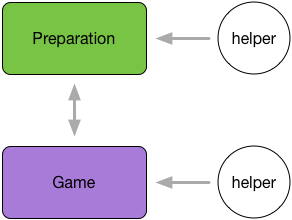
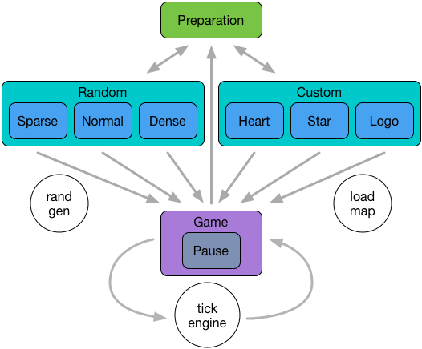
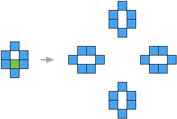
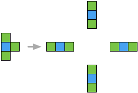

# Game of Life Project Report

**Shichen Liu**</br>
**2014013451**</br>
<liushichen95@gmail.com>

## Contents

========

1. [Overview](#overview)
2. [Implementation](#implement)
3. [Testing](#test)
4. [Conclusion](#conclude)

## [Overview](id:overview)

=========

### Topic

In this project, an interesting game based on cellular-automata is required to be programmed, as we learned during the course, in Javascript. The project is distributed for the sake of acknowledging the principle of quality coding and the Unit Testing.

The game is much like a little bacteria community where each single bacterium cell's life condition depends on the bacteria around itself. Therefore we can observe how the community develops as time passes by.

### Guide

My game plays like follows. Firstly, player can choose different modes to play which consists of **Random mode** and **Custom mode**. Random mode, literally, generates cells under *uniform distribution* in the whole canvas initially and has three levels of degree of density labeled as **Sparse**, **Normal** and **Dense** correspondingly. However, in custom mode, player can initialize the distribution of the cells casually simply by given pictures. Game starts once initialized and the cells develop themselves according to the given algorithm in which a cell will keep living or dying iff **two** living cells circle it, live iff **three** living cells around, and die **otherwise**.

However, when the automatically updating begins, players still have two ways to control the situation. **Pause** at any time makes you clearly inspect each of every cell, while **Click** at any position can plant a living cell at that position.

**New-born** cells are in different color as **older** cells so that one can understand the development of the patterns made of cells easily and thanks to this design I find out some *interesting patterns* that deserve what is called **'automata'** and this interesting part will be stated later in [conclusion](#conclude) part.

### Environment

- OS: Mac OS X El Capitan 10.11.6
- Editor: Emacs 25
- Browser: Safari 9.1.2 / Chrome 52.0.2743.116

### Submit

And the directory of the project list as,

```
game-of-life
├── README.md
├── index.html  ......... Run this to play the game
├── test.html   ......... Run this for unit 
│                         test inspection 
├── css
│   └── stylesheet.css
├── doc
│   ├── doc.md .......... Documentation as markdown
│   ├── doc.pdf ......... Documentation as PDF
│   └── rec
│       └── ...
├── js
│   ├── game.js
│   ├── game_test.js
│   ├── node_modules  ... Used for code checking, 
│   │                     deleted due to it's 10MB size, 
│   │                     and not required for 
│   │                     playing the game     
│   └── package.json              
├── media
│   └── ...
├── node_modules  ....... Things for 'Mocha' and 'Chai'
│   └── ...
└── package.json  
```

**The game is distributed on my personal homepage at [Github](https://lustralisk.github.io/game-of-life)**

### Report

The rest of the report is arranged as follows. The design of models and implementation details in Section [Implementation](#implement). The code quality inspection and unit testing procedures are recorded in Section [Testing](#test). The project result and some of my little discoveries in Section [Conclusion](#conclude).

## [Implementation](id:implement)

========

### Model design
Because my design of game basically consists of two stages, the **preparation** stage where player choose mode and the **game** stage, I separate main function into two modules, one to be responsible for preparation while the other functions the game. Both of them have some **helper functions** provided.



Each in every module, I used several functions to control the process flows, which, in player's aspect, is the response to their actions. Naturally, the flow chart shows like follows:



The chart shows how each modules connects with others and how the different helper functions assist to these connections. *e.g.* to generate a random initialized map, a random generator function is needed. When game starts, it can be either paused or automatically motivate by an engine which contains the algorithm to determine whether each every cell lives.

### Implementation details
As above mentioned, two main functions are defined to support the necessary procedure with several helper function. So it looks like:

| Function | Description |
| -------- | ----------- |
| `startView` | Preparation stage. Create game setting control flow. |
| `startGame` | Game stage. Create grids for cells, run the engine, react to player's action. |
| `generateRandomMap` | Take a degree as argument to generate some density of random initial map. |
| `moveTick` | Engine that take all cells as argument and calculate how their next moves are. |
| `renderMap` | Apply different color on each of every cell. |
| `randomShuffle` | Take an array and return it after random permutation using Knuth Shuffle algorithm. |

*\* several private functions are scoped inside of startView and startGame. Not to mention here.*

**Some details to state that**:

1. The game grid is made of thousands of *\<div\>*s arranged properly.
2. There is no useable random lib except for basic *random* function, so my implementation of generating random map is to firstly create an array which looks like: [1, 1, ..., 1, 0, 0, ..., 0] and then random shuffle it.
3. Each in every action that need to change views(such as click to start game, to back from game to setting chosen menu, *etc*.), I clear all unnecessary existing variables(especially jQuery objects) and then create new one for the next move which assure the memory usage will not keep increasing as actions taken.
4. To allow custom map to be used, I use a *python* script to convert a given image to useable [0, 1] array. However, the algorithm is quite simple, so the image given should in great contrast.
5. The new-born cells are in different color as old ones. In one hand, it looks prettier, in another hand, it help you tracking the tendency how the pattern make its own way.
6. To be able to unit test, the code are separated distinctly into **UI part** and **logic part**. As UI is intractable to test with codes(however, simply click through browser can easily test UI though), I tested the logic part of codes as far as I considered. This will explain later in **Testing** part

## [Testing](id:test)

========

### Code quality inspection
To standardize the quality of code, I inspected my Javascript code with well-known tool, **eslint**, under the configuration of follows:


However, as I used command **eslint game.js** to show the defects of the code, I found that a lot of '$' no-undef shown up. It was then I realized that I should have put **jQuery** used in the project into the environment of **eslint's** setting.


After several steps of correcting, as I haven't had too many errors initially, I reached the demands of the quality.


Then when I changed to *google-style*, a surprisingly more than 330 errors makes me felt uncomfortable. Eventually I decided to use this more critical standard.


As I patiently corrected my code, I gradually found out why company like Google can be such stable and strong. Their standard of coding style is precise as grain as even a placement of space should have its reason. That was what also inspired me a lot, and the decision I made to take hours to correct my code deserved that.


Practice makes perfect. Through the practice of this project, I have had a serious impression of the accuracy of what quality codes can be. Strict, but worth.

### Unit test
In harmony with the pattern of unit-test-based development, I separate my code as stated above so that **logic part** can be abstracted out and easy to be reached.

My approach looks like this, we used to code nested scoped functions in Javascript due to its functional property.

*e.g.*

```
var foo = function() {  
  var ber = function() {
    ...
  };
  var bor = function() {
    ...
  };
  var bar = (function() {
    ber();
    bar();
    ...
  })();
};
...
foo();
```

Then you can change this code to something like this,

```
var foo = function() {  
  var ber = function() {
    ...
  }
  var bor = function() {
    ...
  }
  var bar = function() {  
    ber();
    bor();
    ...
  }
  ...
  return {  
    ber: ber,
    bor: bor,
    bar: bar
  }
}
...
foo().bar();
```

In this way, during test stage, you can actually inspect into the `foo` scope and reach the `ber` and `bor` function by `foo().ber` and `foo().bor`. This technique is quite useful latterly which I've discovered.

What follows are the testing that I designed to ensure the function of each part of the code.

- **get random mode's options**
    - *should be a function*
    - *should have four arguments*
    - **append an option**
        - should append one element once
        - should append correct element
- **get custom mode's options**
    - *should be a function*
    - *should have three arguments*
    - **append an option**
        - should append one element once
        - should append correct element
- **initialize cells in the map**
    - *should be a function*
    - *should have three arguments*
    - **size**
        - should return array has same row as config
        - should return array has same col as config
    - **correctness**
        - should corresponding as the init map
- **clicking adding attribute**
    - *should be a function*
    - **correctness**
        - should attribute correct attr
- **random map generator**
    - *should be a function*
    - **randomness**
        - should be random(normally to be a little bit slow)
    - **size**
        - should as same size as config
    - **degree**
        - should as same degree as config
- **tick engine**
    - *should be a function*
    - *should have two argument*
    - **movement**
        - should die when less than two cells around
        - should keep dead when two cells around
        - should keep live when two cells around
        - should alive when three cells around
        - should die when more than three cells around
        - should concate up and bottom bound
        - should concate left and right bound


## [Conclusion](id:conclude)

========

### Project Impressions
Through this project, I am not only have a chance to practice this brand-new kind of development method, TDD/BDD, but also deep into this way of thinking problems especially the concept of 'driven'. Compared to what we used to do, TDD can dig the great potential of problem solving-based coding, which is largely needed in industrial development. What's more, this novel design pattern sharpen my eyes and enrich my vision, makes me start to think about other new ways of possible design patterns. After all, I learned a lot in this project.

### Interesting Discoveries
I played my game after finish the coding part myself, and find something interesting. Let me show you some of them.

*In following charts, green block represents new-born cells, and blue ones is older one.*

1. Disappear square

    
    
    *A square can be disappeared if one cell is attached to it. Simple but interesting.*

2. Automatic walker

    
    
    *Amazing and awesome structure. As we can see above, An auto-walker like this can move toward right-bottom iteratively. Gradually we can see this little spirit walk across the map. Remember the origin of this game, "Cellular Automata", right? I believe this mechanism is kind of automata.*

3. Self-copy bacteria

    
    
    *This guy is kind of trouble because it always copy itself as you want to destroy it. In fact, as you put a new cell aside of it at anywhere, it will generate into four identical cells.*

4. Long-lasting life

    
    
    *Probably this is the most simple structure in this world. However, this little stick is permanently changing but never disappear.*
    
    
    
    *What's more, this structure can also copy itself like bacteria.*
    
I believe there are far more kinds of these interesting structures in this world known as cellular automata, waited to be discovered. And thanks for reading this documentation.